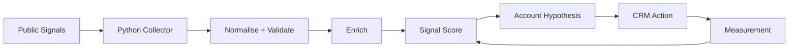

# Granola Signal Intelligence Engine

A GTM Engineering portfolio project that turns public company signals into validated account intelligence, prioritisation scores, CRM actions, and measurable revenue workflows.

> **Portfolio case study:** Granola is used as a real-world SaaS example. This project is independent and is not affiliated with or endorsed by Granola.

## The problem

Revenue teams have access to more company data than ever, but more data does not automatically produce better timing.

A funding announcement, a new GTM leader, three open sales roles, or a geographic expansion may each be mildly interesting on their own. The more useful question is:

**What happens when multiple signals cluster around the same account, and what should the GTM team do about it?**

This project builds a signal intelligence pipeline designed to answer that question.

## Pipeline

**Funding + hiring signals → enrichment → validation → scoring → account hypothesis → CRM action → measurement**



## What this project demonstrates

- Public signal collection from company, funding, and hiring sources
- Data normalisation, deduplication, and validation
- Transparent signal scoring and prioritisation logic
- LLM-assisted account hypothesis generation with verification safeguards
- CRM-ready recommended actions based on signal strength
- Traceable sample outputs for sales and GTM teams
- A measurement loop for testing whether signals correlate with downstream revenue outcomes

## Signal framework

The first version focuses on externally observable signals with plausible commercial relevance.

| Signal | Possible interpretation | GTM implication |
|---|---|---|
| Recent funding | New capital + execution pressure | Increased capacity to invest in GTM |
| GTM hiring | Commercial expansion | Team, territory, or process growth |
| Leadership hiring | Strategic transition | New priorities or operating model |
| Product expansion | Increasing complexity | New personas, workflows, or enablement needs |
| Geographic expansion | New-market motion | Routing, localisation, territory, and data challenges |
| Signal clustering | Several changes occurring together | Higher-confidence prioritisation trigger |

## Scoring philosophy

A single trigger is rarely enough to justify account priority.

The engine therefore evaluates **signal clusters**, incorporating signal strength, recency, source confidence, and GTM relevance.

```text
Priority Score = Signal Strength × Recency × Source Confidence × GTM Relevance
```

The implementation will expose the component scores rather than hiding prioritisation behind an unexplained number.

## Data integrity and LLM safeguards

LLM-generated content is not treated as source-of-truth data.

The pipeline separates three layers:

1. **Observed facts** captured from public sources
2. **Derived fields** produced by deterministic transformation and scoring logic
3. **Generated hypotheses** produced from the validated evidence layer

Validation will include source attribution, timestamp and freshness checks, entity matching, duplicate detection, schema validation, confidence flags, and manual spot checks of sampled outputs.

## Target output

A final account intelligence record will resemble:

```json
{
  "company": "Granola",
  "signals": [
    "recent_funding",
    "gtm_hiring_growth"
  ],
  "priority_score": 82,
  "hypothesis": "Granola appears to be moving toward a more structured commercial expansion motion.",
  "recommended_action": "Map GTM leadership and investigate revenue infrastructure priorities.",
  "confidence": "high",
  "evidence": []
}
```

This example is illustrative. Implemented outputs will link conclusions to supporting evidence.

## Measurement

A useful signal system needs a feedback loop. Candidate metrics include:

- signal-to-action rate
- signal-to-meeting conversion
- signal-to-opportunity conversion
- false-positive rate
- time from signal detection to GTM action
- stage progression
- pipeline and revenue influenced

These outcomes can then inform future signal weighting.

## Repository structure

```text
granola-signal-intelligence-engine/
├── README.md
├── data/
│   ├── raw/
│   ├── processed/
│   └── sample_output/
├── src/
│   ├── collectors/
│   ├── validation/
│   ├── enrichment/
│   ├── scoring/
│   └── hypotheses/
├── config/
├── docs/
│   ├── architecture.md
│   ├── scoring-model.md
│   └── validation-logic.md
├── tests/
├── .env.example
├── .gitignore
└── requirements.txt
```

## Success criteria

Someone reviewing this repository should be able to understand:

- how signals enter the system
- how data integrity is protected
- why an account receives its score
- how evidence becomes a commercially useful hypothesis
- what action should occur in the CRM
- how the resulting motion would be measured

## Project status

🚧 **Phase 1: Architecture and signal design**

Next steps:

- define the initial Granola signal sources
- create the signal data schema
- implement validation rules
- collect initial funding and hiring evidence
- implement the first transparent scoring model
- generate the first evidence-backed account hypothesis

---

Built by **Aanu Oduyemi** as a GTM Engineering / Revenue Operations portfolio project.
